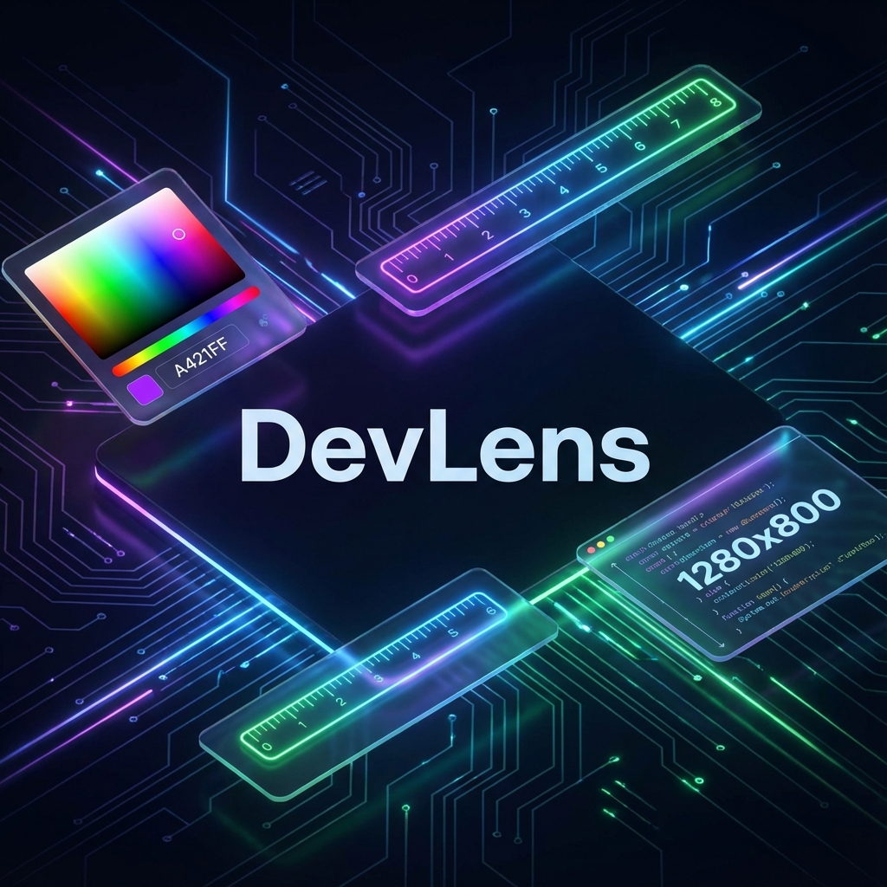

# DevLens - Web Development Tools ⚡

**DevLens** (formerly WebDevTools) is a premium, all-in-one Chrome Extension suite designed for modern web developers. Built with a focus on aesthetics, animation, and performance, it provides essential tools in a beautiful, glassmorphic interface.

## ✨ Features

### 📐 Screen Dimensions
- **Real-time Viewport Info**: A draggable, translucent overlay showing exact `width` x `height`.
- **Smart Snap**: Automatically snaps to edges and respects boundaries.
- **Neon Visibility**: High-contrast gradient text ensures readability on any background.

### 🎨 Ultimate Color Studio
A professional-grade color suite replacing the need for external tools.
- **EyeDropper**: Pick colors from any pixel.
- **Auto-Copy**: Automatically copy HEX/RGB to clipboard.
- **Deep Scan Analyzer**: Scans the DOM to extract all used colors (fills, borders, text, strokes).
- **Gradient Generator**: Create Linear and Radial gradients visually.
- **Palette Browser**: Built-in popular palettes (Material, Tailwind) and history tracking.

### 🔳 Advanced Element Outliner
- **Debug Layouts**: Instantly visualize DOM structure.
- **Customizable**: Adjust stroke width, style (solid/dashed/dotted), and color on the fly.
- **Non-Destructive**: Control panel overlay allows adjustment without refreshing.

### 📏 Screen Ruler & Guides
- **Pixel-Perfect Rulers**: Fixed top and left bars.
- **Draggable Guides**: Pull lines to check alignment.
- **Crosshair Mode**: Full-screen crosshair cursor.
- **Custom Themes**: Adjust ruler opacity and accent color.

## 🚀 Installation

1.  Clone this repository.
2.  Open Chrome and navigate to `chrome://extensions`.
3.  Enable **Developer mode** (toggle in top right).
4.  Click **Load unpacked**.
5.  Select the `DevLens-WebDevTools` directory.

## 🛠️ Technology Stack

-   **Core**: Vanilla JavaScript (no frameworks/bloat).
-   **Styling**: Pure CSS3 with extensive usage of CSS Variables, Backdrop Filter, and Keyframe Animations.
-   **Architecture**: Manifest V3, Modular Content Scripts.

## 📝 License

Distributed under the MIT License. See `LICENSE` for more information.

---
*Designed for Developers by [@MrEshank](https://www.eshank.tech/projects)*
